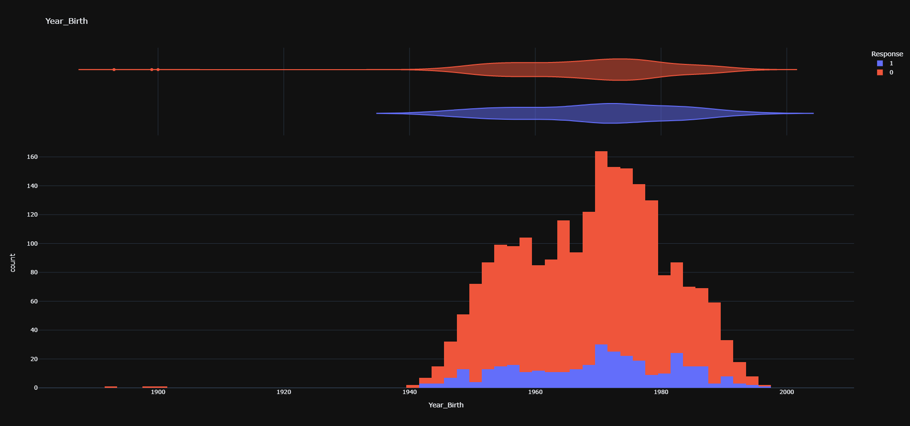
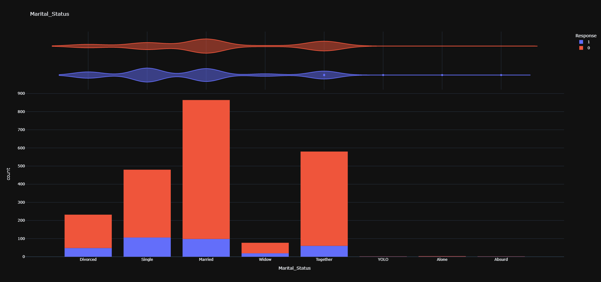
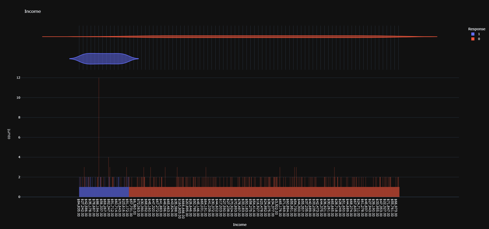
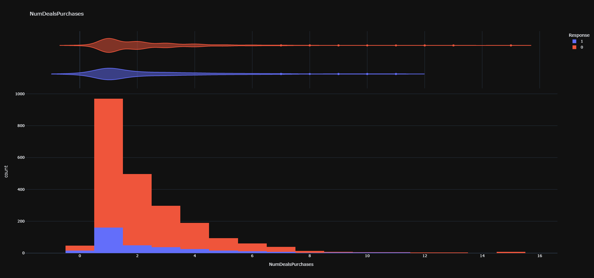
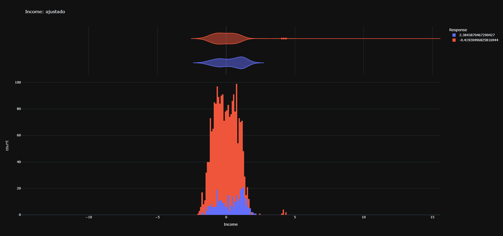
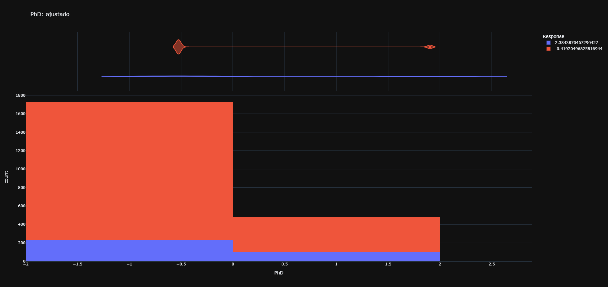
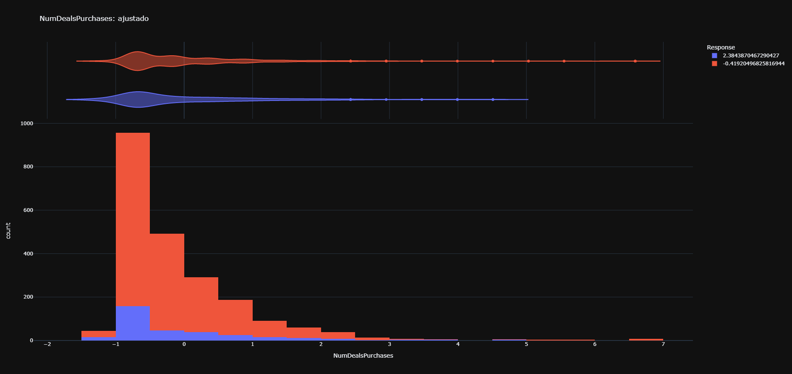
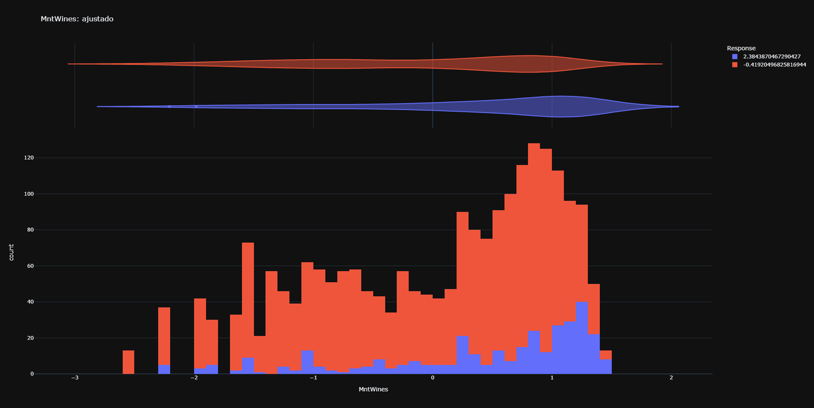

# Relatório Final da disciplina de  Inteligência Computacional - COC 361

de Lucas Ribeiro Ikuhara - DRE 119019172.

## Introdução

### Descrição do problema

Dado o perfil de um consumidor, baseado em informações diversas a seu respeito, como escolaridade, estado marital e compras anteriores prever o resultado de uma campanha publicitária que busca vender um produto.

A proposta é a construção de um modelo utilizando redes neurais para tentar prever o resultado de uma campanha para um determinado indivíduo, a partir de seus dados.

Além disso, buscaremos avaliar os resultados obtidos e comparar-los com outros métodos mais tradicionais, como árvores de decisão e SVMs.

## Dataset e Tecnologia

### Descrição dos dados

O dataset consiste em dados de 2.240 clientes, com 28 colunas. As features presentes são de divididas entre qualitativas, quantitativas e binárias.
As informações dizem respeito as características dos receptores campanhas publicitárias em relação três principais aspectos:

#### Perfil

Diz respeito a sua vida, como por exemplo, ano de nascimento, nível de educação, estado civil, país, renda e a presença ou ausência de crianças ou adolescentes em casa.

#### Atividade no site

Diz respeito aos seus padrões de consumo e atividade na plataforma, como data de criação da conta, tempo desde a última compra, soma de valores de produtos comprados por categoria, número de compras com e sem descontos, e reclamações passadas.

#### Histórico de respostas a campanhas

Diz respeito a reação do cliente a campanhas publicitárias passadas. Denota se as últimas cinco campanhas geraram uma compra, individualmente.

#### Apresentação por coluna

| Coluna | Descrição | Tipo |
|---|---|---|
| ID | Id único do usuário | Nominal
| Year_Birth | Ano de nascimento do usuário | Quantitativa
| Country | Localização do usuário | Qualitativa
| Education | Nível de educação | Qualitativa
| Marital_Status | Estado Civil do usuário | Qualitativa
| Income | Renda anual da residência do usuário | Quantitativa
| Kidhome | Quantidade de crianças que moram com o usuário | Quantitativa
| Teenhome | Quantidade de adolescentes que moram com o usuário | Quantitativa
| Dt_Customer | Data de criação da conta | Quantitativa
| Recency | Número de dias desde a última compra | Quantitativa
| MntWines | Valor gasto em vinhos no últimos 2 anos | Quantitativa
| MntFruits | Valor gasto em frutas no últimos 2 anos | Quantitativa
| MntMeatProducts | Valor gasto em carne no últimos 2 anos | Quantitativa
| MntFishProducts | Valor gasto em peixes no últimos 2 anos | Quantitativa
| MntSweetProducts | Valor gasto em doces no últimos 2 anos | Quantitativa
| MntGoldProds | Valor gasto em ouro no últimos 2 anos | Quantitativa
| NumDealsPurchases | Número de compras feitas com descontos | Quantitativa
| NumWebPurchases | Número de compras realizadas através do site | Quantitativa
| NumCatalogPurchases | Número de compras feitas usando um catálogo | Quantitativa
| NumStorePurchases | Número de compras feitas em lojas físicas | Quantitativa
| NumWebVisitsMonth | Número de visitas ao site por mês | Quantitativa
| AcceptedCmp1 | Denota se a primeira campanha de marketing anterior recebida gerou ou não uma compra | Quantitativa (binária)
| AcceptedCmp2 | Denota se a segunda campanha de marketing anterior recebida gerou ou não uma compra |  Quantitativa (binária)
| AcceptedCmp3 | Denota se a terceira campanha de marketing anterior recebida gerou ou não uma compra | Quantitativa (binária)
| AcceptedCmp4 | Denota se a quarta campanha de marketing anterior recebida gerou ou não uma compra | Quantitativa (binária)
| AcceptedCmp5 | Denota se a quinta campanha de marketing anterior recebida gerou ou não uma compra | Quantitativa (binária)
| Response | Denota se a campanha de marketing recebida gerou ou não uma compra |  Quantitativa (binária)
| Complain | Denota se o consumidor fez alguma reclamação nos últimos 2 anos |  Quantitativa (binária)

### Tecnologias

Todo o código foi desenvolvido utilizando a linguagem Python 3, empregando diversas bibliotecas diferentes para funcionalidade específicas:

- Pandas: utilizado para a leitura e manipulação dos dados recebidos em csv.
- Plotly: utilizado para gerar todas as visualizações apresentadas.
- Scikit Learn (sklearn): utilizado para o treinamento de todos os modelos menos a rede MLP. Utilizado também para a avaliação de modelos e validação cruzada.
- Tensorflow & Keras: utilizado para gerar o modelo classificador MLP.

## Metodologia

### Apresentação da solução

#### Tratamento e visualização de dados

##### Dados faltantes, inválidos ou insignificantes

Os dados faltantes e inválidos, como nulos e NaNs foram removidos, trazendo o número de amostras de 2240 para 2216.

Além disso, a coluna ID foi inteiramente removida, pois não foi considerada relevante para a análise.

##### Visualização de dados

Começamos com a visualização inicial dos dados sem nenhuma forma de tratamento, visando principalmente descobrir quais colunas precisaram de tratamento.

Foram encontrados valores de outliers óbvios nos anos de nascimento e estado civil:

Esses valores foram descartados.

Foram também encontrados valores quer precisaram de formatação adicional, como por exemplo, datas e salários (formatadas como string com '$,.')

esses valores foram transformados em valores numéricos.

Alguns outros valores possuíam valores muito esparsos, como os valores gastos por categorias:

Esses valores foram tratados com uma função log.

Por último, as variáveis qualitativas como estado civil e país sofreram de hot-encoding para que pudessem ser usadas para treinar os modelos.

##### Tratamento de dados

Após identificados todos os tratamentos necessários no passo anterior, os dados foram tratados usando pandas. Além dos tratamentos descritos, ao final todas as colunas foram standartizadas, e o novo dataframe, pronto para treinamento, foi salvo.

Após o tratamento, as features foram plotadas novamente. Exemplos pós tratamento:

##### Correlação

Para visualizar a correlação das variáveis, foi usada a seguinte matriz de correlação.

Quase nenhum par apresenta módulo da correlação maior que 0.5, com notáveis exceções como compras feitas com catálogo e compras de carne. No entanto, não considerou-se que nenhuma das variáveis era redundante, e portanto, nenhuma foi removida.

##### Modelos clássicos

Os modelos clássicos utilizados para comparar os resultados com o modelo proposto no trabalho foram:

- Classificação Baynesiana
- Árvores de decisão
- Random Forest
- Gradient Boosting
- Support Vector Machines

Foram utilizadas implementações da biblioteca Scikit Learn para todos modelos descritos acima.

###### Árvores de Decisão

As árvores de decisão foram testadas, variando os hiperparâmetros de critério entre 'Gini' e 'Entropy', ambas com a profundidade ilimitada.

###### Gradient Boosting
Os modelos de Gradient Boosting foram testados variando os hiperparâmetros da função de perda entre 'deviance' e 'exponential', com 100 estimadores cada.

###### Support Vector Machines
Os modelos de SVM foram testados variando os parâmetros de C. Foram testados os valores C=1 e C=2.s

###### Random Forest
Os modelos de Random Forest foram testadas, variando os hiperparâmetros de critério entre 'Gini' e 'Entropy', ambas com 100 estimadores.

###### Classificador Baynesiano
Os modelo utilizado foi um classificador Gaussiano (Gaussian Naive Bayes), e foi testado com os valores de smoothing de $1^{-9}$ e $1^{-11}$.

##### Modelo proposto

O modelo proposto é uma rede neural, mais especificamente uma rede de perceptrons multi-camada (MLP). A rede foi implementada utilizando Keras, uma API de alto nível para o framework Tensorflow.

##### Critérios de avaliação

